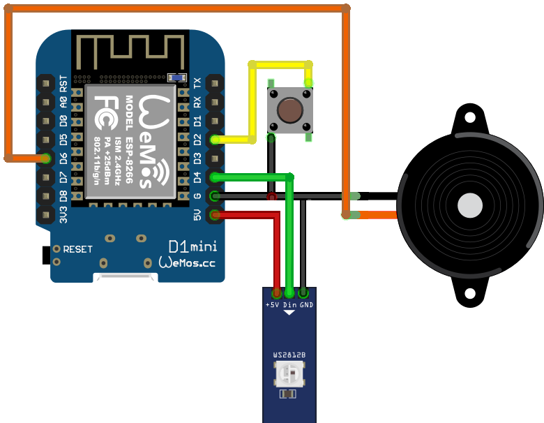
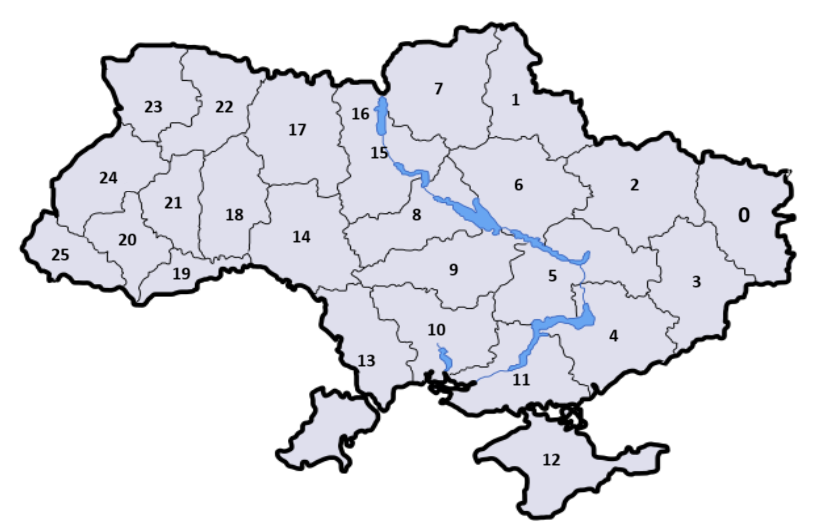
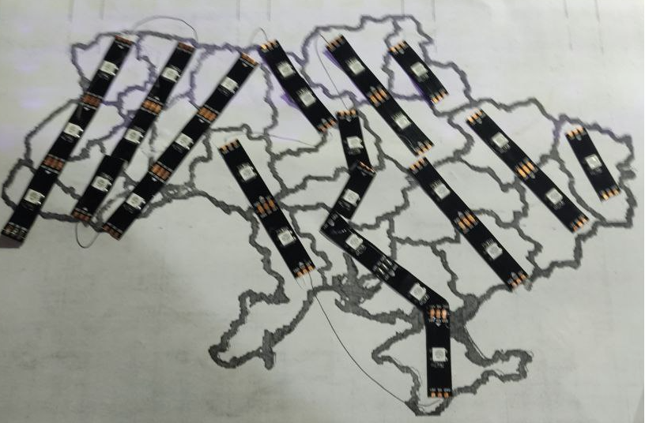
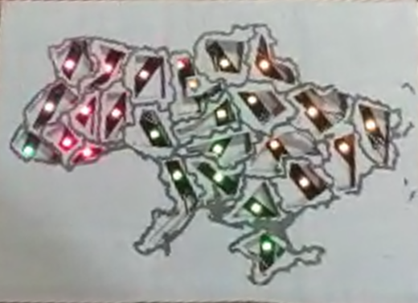
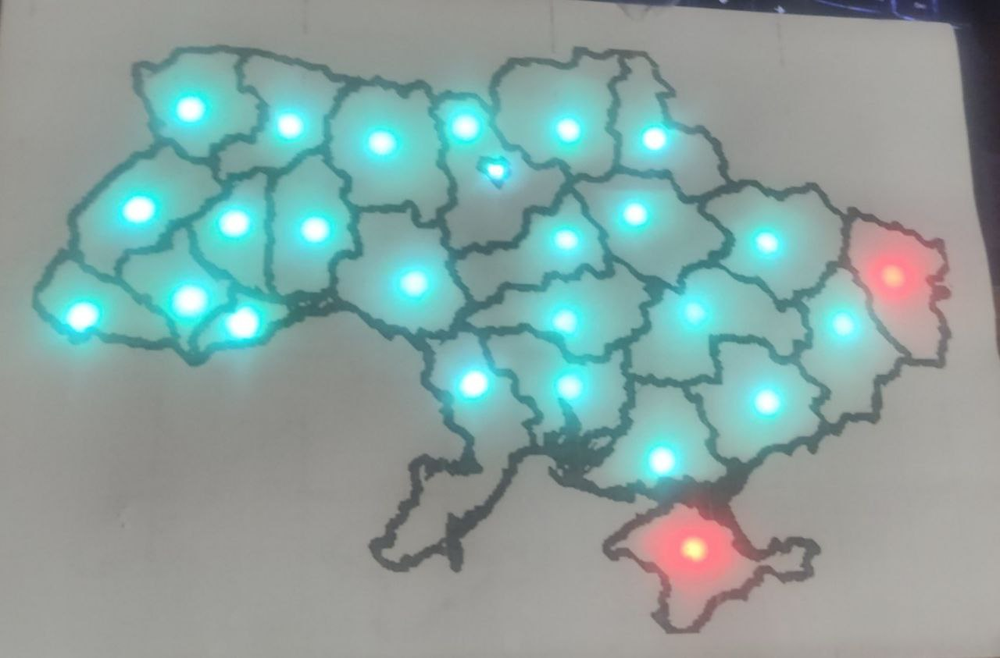

# Карта Воздушных Тревог ESP8266 

# ❗❗❗НЕ ВСЕ ВОЗДУШНЫЕ ТРЕВОГИ МОГУТ ПЕРЕДАВАТЬСЯ ВО ВРЕМЯ ИЛИ ВООБЩЕ ПЕРЕДАВАТЬСЯ, НЕ СТОИТ ОРЕНТИРОВАТЬСЯ НА ЭТУ КАРТУ КАК НА ЕДИНСТВЕННЫЙ ИСТОЧНИК, ОРЕНТИРУЙТЕСЬ НА УВЕДОМЛЕНИЯ ОТ ВЛАСТЕЙ ИЗ ОФФИЦИАЛЬНЫХ ИСТОЧНИКОВ

## ❗❗ЭТОТ ПРОЭКТ МОЖНО ИСПОЛЬЗОВАТЬ В ДОПОЛНЕНИЕ НЕ БОЛЕЕ. 

## ❗В режиме анимаций звуковые оповешения не работают

## Описание проекта
Проект "Карта Воздушных Тревог ESP8266" создан для визуализации информации о состоянии тревог в различных регионах. Устройство использует светодиодную ленту и звуковой сигнал для отображения активных регионов, мигания в соответствии с уровнем тревоги и воспроизведения звукового сигнала при необходимости. Устройство подключено к Wi-Fi и получает данные о тревогах с внешнего сервера.

## Содержание
1. [Настройки](#Настройки)
2. [Для Разработчиков](#Для-Разработчиков)
3. [Схема Подключения](#Схема-Подключения)
4. [Порядок Подключения Светодиодов](#Порядок-Подключения-Светодиодов)
5. [Пример реализации](#Пример-укладки-(можно-сделать-лучше))
6. [Реализация](#Реализация)
7. [Папки Проекта](#Папки-Проекта)
8. [Лицензия](#Лицензия)

## Настройки
В разделе "Настройки" определены параметры, которые можно настроить под свои требования:

- **Wi-Fi Сеть:** Имя и пароль для подключения к домашней Wi-Fi сети.
- **Домашние Регионы:** Определение регионов (областей), которые будут мигать и оповещать в случае тревоги. Для изменения регионов смотрите схему подключения светодиодов на картинке или в коде на строке 46.
- **Звуковое Оповещение:** Флаг, указывающий, должно ли происходить звуковое оповещение по домашним регионам при включении.

## Схема Подключения

## Порядок Подключения Светодиодов

## Пример укладки (можно сделать лучше)

### Распечатал 3 листа с картой Украины, два из них наклеял на картонки, на одной из налепил ленту и спаял схему, из второй сделал проставку повырезал контуры областей и наклеял на первую картонку. В левом нижнем углу проделал дырку, вставил кабель от сенсорной кнопки, залил области и светодиоды термоклеем для лучшей проводимости света, а поверх наклеял плотную бумагу с картой. 

    
    

 

    
    
  

## Видео

## Реализация
### Запуск
1. **Загорание Сине-Желтого Светодиода:** При запуске устройства светодиоды мигают сине-желтым, указывая на процесс подключения к домашней Wi-Fi сети. Дождитесь установления соединения.
2. **Отображение Карты Воздушных Тревог:** После успешного подключения к Wi-Fi устройство переходит в режим отображения информации о тревогах в регионах.

### Управление Режимами
- **Переключение Режимов Анимации:** Нажмите один раз на кнопку устройства для смены предустановленных анимаций.
- **Включение/Выключение Звукового Оповещения:** Удерживайте кнопку, чтобы включить или выключить звуковое оповещение. Светодиоды могут сигнализировать о состоянии звукового оповещения.

## Папки Проекта
- **libraries:** Библиотеки проекта.
- **firmware:** Прошивка для ESP8266.
- **schemes:** Схемы подключения компонентов.

## Лицензия
Этот проект лицензирован в соответствии с [MIT License](LICENSE). Вы вправе использовать, модифицировать и распространять код в соответствии с условиями лицензии.
